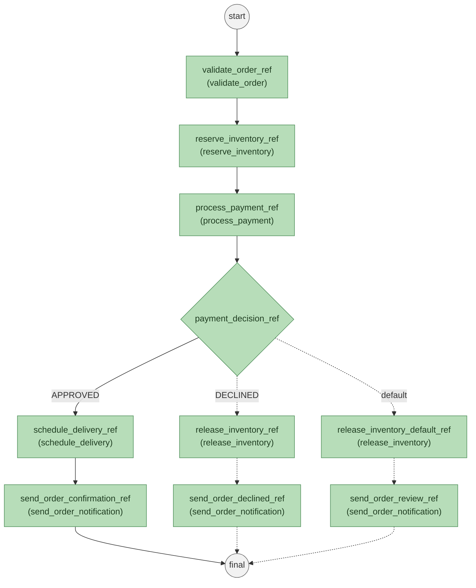

# Spring Kotlin Orkes Conductor
This project demonstrates Orkes Conductor with a real-time order fulfillment scenario. The main idea is to show how a business process can be split into small workers, registered as Conductor tasks, and connected by a workflow definition. The sample order flow validates the request, reserves inventory, processes payment, then either schedules delivery or compensates by releasing the reserved inventory.

## Core Scenario
The demo models a simplified e-commerce checkout flow:

1. A client submits an order to the Spring Boot API.
2. The API starts `order_fulfillment_workflow` in Conductor.
3. Conductor schedules each task based on `workflow.json`.
4. Spring worker beans poll Conductor and execute the task logic.
5. The payment result controls whether the order is confirmed or compensated.

### The workflow structure looks like this:

And the textual representation of the workflow is:
```text
POST /api/v1/orders
        |
        v
order_fulfillment_workflow
        |
        v
validate_order -> reserve_inventory -> process_payment
                                      |
                                      v
                              payment_decision
                               /          \
                       APPROVED          DECLINED/default
                          |                    |
                          v                    v
                  schedule_delivery     release_inventory
                          |                    |
                          v                    v
                 send_order_notification send_order_notification
```

## Core Logic
### 1. Workflow Metadata Registration
On application startup, `SpringKotlinConductorApplication.setup()` calls `WorkflowDefinition2.loadWorkflowsAndTasks(...)`.

That service:
- Reads task definitions from `src/main/resources/task.json`.
- Reads the workflow definition from `src/main/resources/workflow.json`.
- Verifies that every `SIMPLE` task used by the workflow has a matching task definition.
- Creates or updates task definitions in Conductor through `/metadata/taskdefs`.
- Registers the workflow definition through `/metadata/workflow`.

This makes the demo self-registering: after Conductor is running, starting the Spring app publishes the workflow and task metadata automatically.

### 2. Workflow Trigger
The REST endpoint is defined in `SpringKotlinConductorApplication.kt`:

```http
POST http://localhost:8081/api/v1/orders
```

The request body is mapped to `OrderWorkflowRequest`, converted into workflow input, and submitted with `WorkflowClient.startWorkflow(...)`.

The workflow input contains:

- `orderId`
- `customerId`
- `items`
- `totalAmount`
- `deliveryAddress`
- `paymentMethod`
- `priority`
- `notificationChannel`

### 3. Worker Execution
Each worker is a Spring `@Service` implementing Conductor's `Worker` interface. The worker name returned from `getTaskDefName()` must match a task name in `task.json` and `workflow.json`.

| Worker | Task | Responsibility |
| --- | --- | --- |
| `ValidateOrderWorker` | `validate_order` | Checks required order fields, verifies that the order has items, and rejects non-positive totals. |
| `ReserveInventoryWorker` | `reserve_inventory` | Simulates stock reservation and fails when an item is unavailable or has SKU `OUT_OF_STOCK`. |
| `ProcessPaymentWorker` | `process_payment` | Simulates payment authorization. `DECLINED`, `FAIL`, and `INVALID_CARD` produce a declined payment. |
| `ScheduleDeliveryWorker` | `schedule_delivery` | Creates a delivery id and sets ETA to `30` minutes for `EXPRESS`, otherwise `90`. |
| `ReleaseInventoryWorker` | `release_inventory` | Runs the compensation step when fulfillment cannot continue. |
| `SendOrderNotificationWorker` | `send_order_notification` | Simulates customer notification for confirmed, declined, or review states. |

Common input parsing and `TaskResult` helpers live in `src/main/kotlin/com/github/senocak/orkes/service/workers/extensions.kt`.

### 4. Decision Branching
The decision point is `payment_decision` in `workflow.json`. It reads:

```text
${process_payment_ref.output.paymentStatus}
```

Branch behavior:
- `APPROVED`: schedules delivery, then sends a `CONFIRMED` notification.
- `DECLINED`: releases inventory, then sends a `PAYMENT_DECLINED` notification.
- Any unexpected value: releases inventory, then sends a `PENDING_REVIEW` notification.

This is the most important workflow behavior in the project because it demonstrates how Conductor can coordinate both the happy path and a compensation path.

## Project Map
| Path | Purpose |
| --- | --- |
| `src/main/kotlin/com/github/senocak/orkes/SpringKotlinConductorApplication.kt` | Application entrypoint, metadata setup hook, and order trigger endpoint. |
| `src/main/kotlin/com/github/senocak/orkes/service/WorkflowDefinition2.kt` | Loads task/workflow metadata and registers it in Conductor. |
| `src/main/kotlin/com/github/senocak/orkes/service/workers/` | Contains the task worker implementations. |
| `src/main/resources/task.json` | Conductor task definitions, retries, timeouts, inputs, and outputs. |
| `src/main/resources/workflow.json` | Conductor workflow definition and decision branches. |
| `src/main/resources/application.yml` | Spring and Conductor connection settings. |
| `src/main/resources/requests.http` | Ready-to-run approved and declined order requests. |
| `docker-compose.yml` | Local Orkes Conductor standalone server. |

## Run Locally
Start Conductor:

```sh
docker-compose up -d
```

Conductor endpoints:
- API: `http://localhost:9090/api/`
- UI: `http://localhost:1234/`

Start the Spring Boot app:
```sh
./gradlew bootRun
```

The app runs on:
```text
http://localhost:8081
```

## Try the Flow
### Approved Payment
```http
POST http://localhost:8081/api/v1/orders
Content-Type: application/json

{
  "orderId": "ORD-1001",
  "customerId": "CUS-42",
  "items": [
    {
      "sku": "BOOK-001",
      "quantity": 1,
      "price": 24.99
    },
    {
      "sku": "HEADPHONE-002",
      "quantity": 1,
      "price": 79.50
    }
  ],
  "totalAmount": 104.49,
  "deliveryAddress": "Levent, Istanbul",
  "paymentMethod": "CARD",
  "priority": "EXPRESS",
  "notificationChannel": "EMAIL"
}
```

Expected path:

```text
validate_order
reserve_inventory
process_payment -> APPROVED
schedule_delivery
send_order_notification -> CONFIRMED
```

### Declined Payment
```http
POST http://localhost:8081/api/v1/orders
Content-Type: application/json

{
  "orderId": "ORD-1002",
  "customerId": "CUS-43",
  "items": [
    {
      "sku": "PHONE-001",
      "quantity": 1,
      "price": 899.00
    }
  ],
  "totalAmount": 899.00,
  "deliveryAddress": "Kadikoy, Istanbul",
  "paymentMethod": "DECLINED",
  "priority": "STANDARD",
  "notificationChannel": "SMS"
}
```

Expected path:

```text
validate_order
reserve_inventory
process_payment -> DECLINED
release_inventory
send_order_notification -> PAYMENT_DECLINED
```

## Configuration
Default local configuration:

```yaml
server:
  port: 8081

conductor:
  url: http://localhost:9090/api/
  threadCount: 5
  timeOut: 10_000
```

`threadCount` controls how many worker polling threads are started by `TaskRunnerConfigurer`.

## Notes

- `WorkflowDefinition2` is the active metadata loader.
- `WorkflowDefinition1` is an alternate JSON-node based loader and is currently commented out in the startup hook.
- Worker output keys are intentionally reused by downstream tasks through Conductor expressions such as `${validate_order_ref.output.orderId}` and `${process_payment_ref.output.paymentStatus}`.
